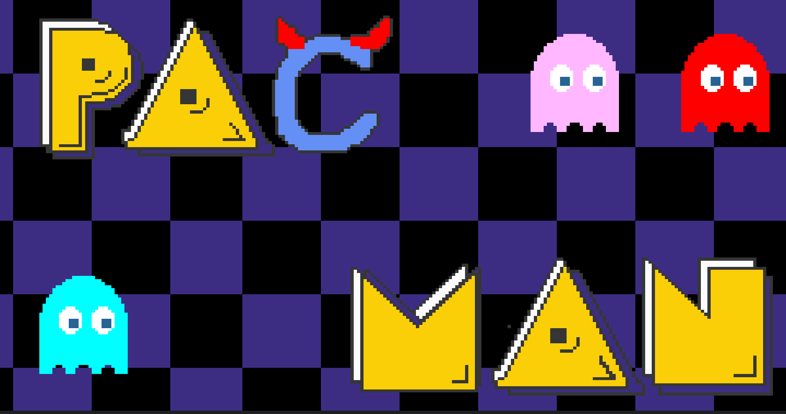
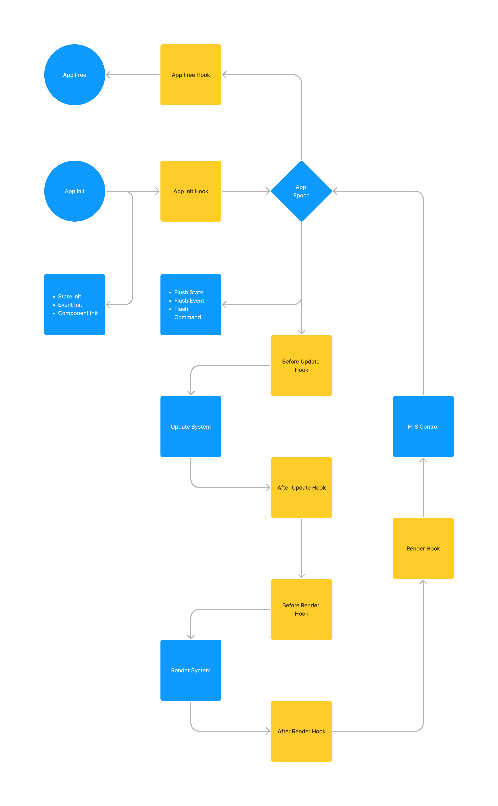
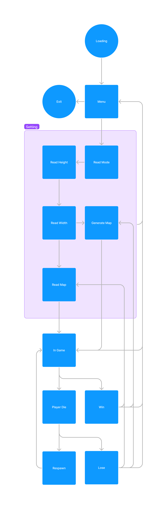

# Hell pa🇨 men

[](https://wakatime.com/badge/user/018b677c-491b-487f-843a-068f3eb4badc/project/018bb6a2-2c88-476b-9a8c-5d3a3cfd7f48)

> Hell is not bad but you know heaven exist.
> 
> C & Cmake is not bad but you know other language exist.



# Getting Start

You need [bazel](https://bazel.build/) and [just](https://just.systems/)

Make sure you terminal is at lease 67 lines and 240 columns, you can use following command to check.

```bash
$ tput lines cols
```

I recommand use [Alacritty](https://alacritty.org/) or [Wezterm](https://wezfurlong.org/wezterm/) for better experience. Then run

```bash
$ just
```

The game should start automatically

All command

```bash
$ just -l
Available recipes:
    debug-build          # debug build all project
    gen-compile-commands # Generate compiles_commands.json for clangd extension, for more info https://github.com/hedronvision/bazel-compile-commands-extractor
    memtest file         # run memory test, output is `valgrind-out.txt`
    run                  # run main project (game)
    test-all             # test all project
```

# Key Map

- <kbd>⏎ Enter</kbd> Confirm Input
- <kbd>⎋ ESC</kbd> Back to menu / Exit Game
- <kbd>Space</kbd> <kbd>W</kbd> <kbd>S</kbd> Change Mode
- <kbd>W</kbd> <kbd>A</kbd> <kbd>S</kbd> <kbd>D</kbd> Move player

# Roadmap

- [x] Basic Parts (40%) 
    - [x] The map system (15%) 
    - [x] The booster system (10%)
    - [x] Pointers (5%) 
        - You can not use external/global variables
    - [x] Pointers and Array (5%) 
        - Use `malloc` for the map
    - [x] Functions (5%) 
        - [x] A clean main function (you need to distribute most of the statements to different functions and only keep the function calls in the main function)
        - [x] Don’t place the main function in strange places
- [x] Extra Parts (40%) 
    - [x] Others (20%)
    - [x] Clean code architecture (5%) 
    - [x] Detailed comments (5%) 
    - [x] Clearly explain your codes during the demonstration (5%)
    - [x] Working with GenAI Tools in a creative way and providing descriptions of the collaboration process in the code comments (5%)


## Basic Part

- [x] Player can enter the number of width and length of the map
- [x] Generate Map by using `rand()`
- [x] Press w, a, s, d to move `P` around with 1 step
- [x] player can move `P` to get `S` and `B`
- [x] Player need get all `S` to win the game 
- [x] Display win message in win stage
- [x] Win menu prompt player to start a new game or terminate the program.
- [x] Design your formula to calculate the appropriate number of `S`, `B`, and `M` base on size of map
- [x] When `P` encounter `M` reduce `life` by 1
- [x] If `life == 0`, player lose
- [x] After `P` move, `M` will move 1 step by using `rand()`
- [x] Determine booster type by `rand()`
- [x] Freeze booster : pause `M` movement for 3 turn
- [x] Less monster booster : despawn 1 `M`
- [x] Extra live booster : increase `life` by 1

## Extra Part

> There are many ways to enhance the overall gaming experience of Pac-Man. One way is to incorporate additional features that can make the game more challenging and exciting. For instance, you can create a level system that increases the game's difficulty as the player progresses and achieves higher scores. You can also incorporate background music and graphics to enhance the game's visual and auditory appeal. Furthermore, adding special sound effects for specific events can add a new dimension to the game's overall experience. The main objective is to create an enjoyable game that not only entertains the players but also encourages them to explore and learn new C-based libraries to implement advanced functions. Please refer to the grading guidelines provided in the grading section for more information.

# ECS : evangel



# Game



# Code Design

- `V{Structure Name}` is a Trait (VTable)
- `P{Structure Name}` is a Pointer of VTable (`self*, VTable*`)
- `C{Structure Name}` is a Collection of method of `{Structure Name}`
- `hook_{Function Name}` is a Hook call by engine

# Naming

- `StructureUpperCamelCase`
- `EnumUpperCamelCase`
- `EnumUpperCamelCase_VariantUpperCamelCase`
- `ItemMacroUpperCamelCase`
- `function_snake_case`
- `Type(FakeGeneric)`
- `fake_typed_function_macro_snake_case`
- `OverLoadingMacroCamelCase`


# Copyright Info

- Bandai Namco Entertainment
    - beginning.wav
    - booster.wav
    - death.wav
    - eat.wav
    - ghost_dead.wav
    - siren.wav
    - walk.wav
- Generate
    - [select.wav](https://sfxr.me/#34T6PkpseuE9uptXJmxHGbiuWVy1ezbfxVFMKLEgBUR8YuMXNWo4ho9JKSvWyMA2S5q7cBzwbrdNbzzpspMgkVybdNrgCKaGmN5J5p6uF4E4tRANWE8mG4UvB)
- Made by myself
    - All pixel art

# References

- [Mojoc (C)](https://github.com/scottcgi/Mojoc)
- [Bevy (Rust)](https://bevyengine.org/)
- [Flecs (C)](https://github.com/SanderMertens/flecs)
- [ECS FAQ](https://github.com/SanderMertens/ecs-faq)
- [Let's build an Entity Component System (Zig)](https://devlog.hexops.com/2022/lets-build-ecs-part-2-databases/)
- [Building an ECS #2: Archetypes and Vectorization (C)](https://ajmmertens.medium.com/building-an-ecs-2-archetypes-and-vectorization-fe21690805f9)
- [Google Test (C++)](http://google.github.io/googletest/)

# Resource

- [Pac Man Sound](https://www.classicgaming.cc/classics/pac-man/sounds)
- [Requirement](https://docs.google.com/document/d/1pbmqKgjQ75Juk1BeeBKcBVxS9AebBml3H2rgWHhogiw/edit)
- [Flow Chart](https://www.figma.com/file/TJTb9l92ZRyPwzzIVTvIJK/eva?type=whiteboard&node-id=0%3A1&t=xQwQpqVY7coJsoAm-1)